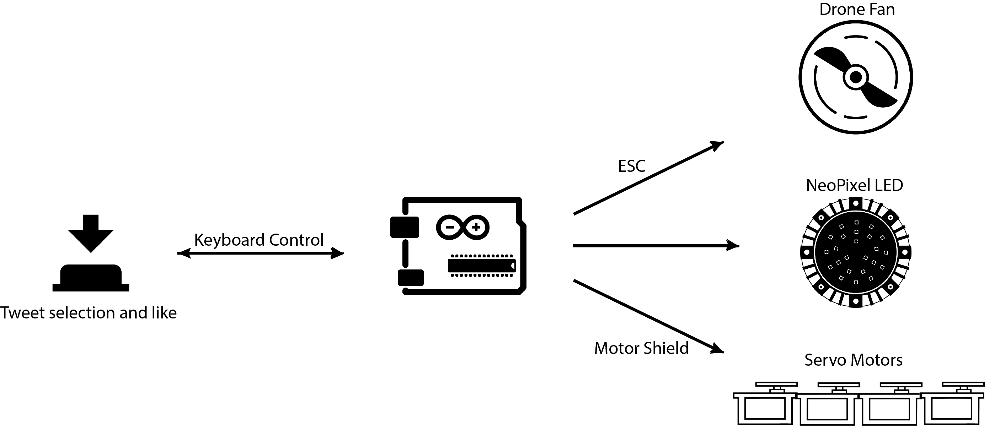

# TheMachineSighs
Input: Keyboard Control through a push button   
Output:  
1. A Drone RC motor through ESC 
2. NeoPixel 
3. 4 Servo motors 

[Demo video](https://vimeo.com/351881662) 
[Details](https://youjin.io/Sigh)
